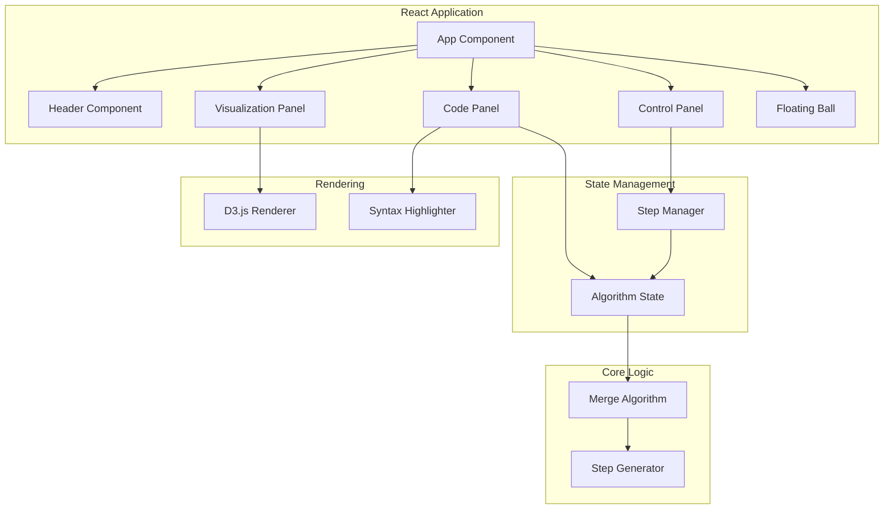

# Design Document

## Overview

本项目是一个 LeetCode 第 21 题「合并两个有序链表」的交互式算法可视化工具。采用 TypeScript + React + D3.js 技术栈，构建单屏幕 Web 应用，部署在 GitHub Pages 上。

核心功能包括：
- 链表合并算法的图形化演示
- Java 代码展示与调试效果（行高亮、变量值显示）
- 键盘快捷键控制（←/→/空格）
- 微信交流群悬浮球

## Architecture



### 技术栈

- **前端框架**: React 18 + TypeScript
- **可视化库**: D3.js
- **代码高亮**: Prism.js 或 highlight.js
- **构建工具**: Vite
- **部署**: GitHub Pages + GitHub Actions

## Components and Interfaces

### 1. App Component

根组件，负责整体布局和状态管理。

```typescript
interface AppProps {}

interface AppState {
  currentStep: number;
  isPlaying: boolean;
  steps: AlgorithmStep[];
  l1: number[];
  l2: number[];
}
```

### 2. Header Component

页面头部，包含标题和 GitHub 链接。

```typescript
interface HeaderProps {
  title: string;
  leetcodeUrl: string;
  githubUrl: string;
}
```

### 3. Code Panel Component

代码展示面板，支持语法高亮和调试效果。

```typescript
interface CodePanelProps {
  code: string;
  currentLine: number;
  variables: VariableState[];
}

interface VariableState {
  name: string;
  value: string;
  line: number;
}
```

### 4. Visualization Panel Component

D3.js 可视化面板，展示链表合并过程。

```typescript
interface VisualizationProps {
  l1: ListNode | null;
  l2: ListNode | null;
  merged: ListNode | null;
  currentPointers: PointerState;
  highlightedNode: string | null;
}

interface PointerState {
  p1: number | null;  // l1 当前指针位置
  p2: number | null;  // l2 当前指针位置
  current: string;    // 当前操作的链表 'l1' | 'l2'
}
```

### 5. Control Panel Component

控制面板，包含播放控制按钮。

```typescript
interface ControlPanelProps {
  isPlaying: boolean;
  currentStep: number;
  totalSteps: number;
  onPrevious: () => void;
  onNext: () => void;
  onPlayPause: () => void;
  onReset: () => void;
}
```

### 6. Floating Ball Component

悬浮球组件，展示微信群二维码。

```typescript
interface FloatingBallProps {
  qrCodeUrl: string;
  hintText: string;
}
```

## Data Models

### ListNode

```typescript
interface ListNode {
  val: number;
  next: ListNode | null;
  id: string;  // 用于 D3.js 追踪
}
```

### AlgorithmStep

```typescript
interface AlgorithmStep {
  stepIndex: number;
  description: string;
  currentLine: number;
  variables: VariableState[];
  l1State: ListNode | null;
  l2State: ListNode | null;
  mergedState: ListNode | null;
  pointers: PointerState;
  highlightedNodeId: string | null;
}
```

### VariableState

```typescript
interface VariableState {
  name: string;
  value: string;
  line: number;
}
```

## Correctness Properties

*A property is a characteristic or behavior that should hold true across all valid executions of a system-essentially, a formal statement about what the system should do. Properties serve as the bridge between human-readable specifications and machine-verifiable correctness guarantees.*

### Property 1: Step Navigation Consistency

*For any* current step index and navigation action (previous/next), the resulting step index SHALL be within valid bounds [0, totalSteps-1] and change by exactly 1 in the expected direction (or remain unchanged at boundaries).

**Validates: Requirements 4.1, 4.2**

### Property 2: Play/Pause Toggle Round-Trip

*For any* play state, toggling play/pause twice SHALL return to the original state.

**Validates: Requirements 4.3**

### Property 3: Code Line Highlighting Consistency

*For any* algorithm step, the highlighted line number in the Code Panel SHALL match the `currentLine` value in the step's state.

**Validates: Requirements 3.2**

### Property 4: Variable Display Completeness

*For any* algorithm step with variables, all variables in the step's `variables` array SHALL be displayed with their correct values at their corresponding line positions.

**Validates: Requirements 3.3**

### Property 5: Linked List Visualization State Consistency

*For any* algorithm step, the visualization SHALL correctly render the current state of l1, l2, and merged lists, with the highlighted node matching `highlightedNodeId`.

**Validates: Requirements 5.1, 5.3**

### Property 6: Merge Result Correctness

*For any* two sorted input arrays l1 and l2, the final merged result SHALL be a sorted array containing all elements from both inputs.

**Validates: Requirements 5.4**

### Property 7: Image Aspect Ratio Preservation

*For any* displayed QR code image, the rendered width/height ratio SHALL equal the original image's aspect ratio (within 1% tolerance).

**Validates: Requirements 6.3**

## Error Handling

### User Input Errors

- 键盘事件在非焦点状态下仍应响应
- 快速连续按键应防抖处理

### Visualization Errors

- 空链表输入应正确处理并显示空状态
- D3.js 渲染错误应捕获并显示友好提示

### Network Errors

- 静态资源加载失败应显示占位符
- QR 码图片加载失败应显示备用提示

## Testing Strategy

### 单元测试

使用 Vitest 进行单元测试：

- 测试 `mergeTwoLists` 算法核心逻辑
- 测试 `StepGenerator` 生成的步骤序列
- 测试组件渲染和状态更新

### 属性测试

使用 fast-check 进行属性测试：

- 每个属性测试运行至少 100 次迭代
- 测试文件使用 `*.property.test.ts` 命名
- 每个测试必须标注对应的 correctness property

```typescript
// 示例：Property 6 测试
// **Feature: leetcode-21-visualization, Property 6: Merge Result Correctness**
test.prop([fc.array(fc.integer()), fc.array(fc.integer())])(
  'merged result contains all elements sorted',
  (arr1, arr2) => {
    const l1 = arrayToList(arr1.sort((a, b) => a - b));
    const l2 = arrayToList(arr2.sort((a, b) => a - b));
    const merged = mergeTwoLists(l1, l2);
    const result = listToArray(merged);
    const expected = [...arr1, ...arr2].sort((a, b) => a - b);
    return arraysEqual(result, expected);
  }
);
```

### 集成测试

- 测试键盘快捷键与控制面板的联动
- 测试步骤切换与可视化更新的同步
